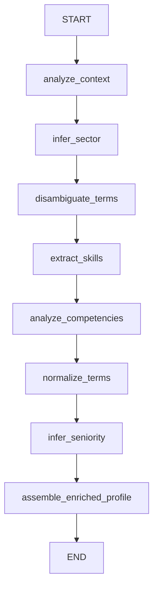

# Sistema de Enriquecimiento Semántico y Desambiguación de Perfiles Profesionales

## 📋 Descripción General

Sistema sector-agnóstico de enriquecimiento semántico de perfiles profesionales construido con LangGraph. Diseñado específicamente para resolver el problema crítico de términos polisemánticos en CVs de cualquier sector.

## 🎯 Problema que Resuelve

findr recibe CVs de múltiples sectores y sufre confusión sistemática con términos ambiguos:

| Término | Ambigüedad | Sectores |
|---------|-----------|----------|
| **Java** | Lenguaje de programación vs café | Software vs Hostelería |
| **automatización** | Test automation (Selenium/Python) vs Control industrial (SCADA/PLC) | Software vs Industrial |
| **React** | Framework JavaScript vs verbo reactivo | Software vs General |
| **Django** | Framework Python vs película | Software vs Entretenimiento |
| **SAP** | Sistema ERP vs savia de árbol | IT/Consultoría vs Irrelevante |
| **Odoo** | ERP Python vs acrónimo sin sentido | IT/Consultoría vs Irrelevante |
| **Python** | Lenguaje de programación vs serpiente | Tech vs Irrelevante |

## 🏗️ Arquitectura del Sistema

### Grafo LangGraph



### Componentes del Pipeline

1. **Context Analysis** 🔍
   - Extrae indicadores clave: empresas, roles, tecnologías
   - Identifica señales de dominio profesional
   - Analiza patrones lingüísticos y actividades

2. **Sector Inference** 🎯
   - Determina sector profesional principal
   - Identifica sectores secundarios/adyacentes
   - Proporciona scoring de confianza (0.0-1.0)
   - Genera evidencia y razonamiento

3. **Term Disambiguation** 🔀
   - Resuelve términos polisemánticos
   - Usa contexto sectorial para interpretación
   - Analiza co-ocurrencias de tecnologías
   - Rechaza significados alternativos explícitamente

4. **Skills Extraction** 🛠️
   - **Explícitos**: Skills mencionados directamente
   - **Implícitos**: Inferidos de experiencia y actividades
   - Categorización: technical, soft, functional, domain_specific
   - Estimación de nivel de proficiencia

5. **Competencies Analysis** 💼
   - Soft skills: Liderazgo, comunicación, colaboración
   - Competencias funcionales: Gestión de proyectos, optimización
   - Competencias gerenciales: Gestión de equipos, estrategia

6. **Term Normalization** 📚
   - Mapas de sinónimos: React → [React, React.js, ReactJS]
   - Términos canónicos: ReactJS → React
   - Taxonomía tecnológica por categorías

7. **Seniority Inference** 📊
   - Niveles: junior, mid, senior, lead, principal, expert
   - Basado en: años experiencia, complejidad roles, liderazgo
   - Scoring de confianza y evidencia

8. **Profile Assembly** 📦
   - Mantiene datos originales completos
   - Añade sección semantic_enrichment estructurada
   - Incluye key_insights para acceso rápido
   - Proporciona explainability completa

## 🚀 Instalación y Uso

### Instalación

```bash
# Desde la raíz del proyecto
cd /workspace

# Instalar con uv
uv sync

# O con pip
pip install -e .
```

### Uso Básico

```python
from profile_enrichment.enrichment_agent import enrich_profile
from datetime import datetime

# Perfil de entrada (ejemplo industrial)
raw_profile = {
    "id": "uuid-123",
    "full_name": "Luis Hidalgo",
    "heading": "Técnico de automatización y sistemas de control industrial",
    "description": "Especialista en automatización de plantas...",
    "experience_years": 6,
    "skills": [
        {"name": "automatización", "level": "Advanced"},
        {"name": "SCADA", "level": "Advanced"},
        {"name": "Python", "level": "Intermediate"}
    ],
    "experiences": [...]
}

# Enriquecer
enriched = enrich_profile(
    raw_profile=raw_profile,
    candidate_id="ec142b18-befd-4f89-9f3d-98a7b53c3fr2",
    metadata={"timestamp": datetime.now().isoformat(), "source": "linkedin_scraper_v2"}
)

# Acceder a resultados
print(enriched["semantic_enrichment"]["key_insights"]["primary_sector"])
# Output: "industrial_automation"

print(enriched["semantic_enrichment"]["disambiguation_map"]["automatización"])
# Output: {
#   "meaning": "Industrial process automation using SCADA/PLC systems",
#   "domain": "industrial_control_systems", 
#   "confidence": 0.95
# }
```

### Uso desde Notebook

```python
# Ver notebook completo de demostración
jupyter notebook notebooks/profile_enrichment/profile_enrichment.ipynb
```

## 📊 Output del Sistema

### Estructura del JSON Enriquecido

```json
{
  "candidato_id": "...",
  "timestamp": "2025-11-14T10:18:00Z",
  "metadata": {...},
  "perfil_raw": {...},  // ✅ Datos originales preservados
  
  "semantic_enrichment": {
    "version": "1.0",
    "enrichment_timestamp": "2025-11-14T10:20:15Z",
    
    "key_insights": {
      "primary_sector": "industrial_automation",
      "sector_confidence": 0.95,
      "seniority_level": "senior",
      "years_experience": 6,
      "total_skills_identified": 18,
      "competencies_count": 12,
      "disambiguated_terms_count": 8
    },
    
    "disambiguation_map": {
      "automatización": {
        "meaning": "Industrial process automation with SCADA/PLC",
        "domain": "industrial_control_systems",
        "confidence": 0.95
      },
      "Python": {
        "meaning": "Python programming for industrial test automation",
        "domain": "software_testing",
        "confidence": 0.90
      }
    },
    
    "structured_skills": {
      "explicit": [...],   // Skills mencionados directamente
      "implicit": [...],   // Skills inferidos de experiencia
      "clusters": {...}    // Skills relacionados agrupados
    },
    
    "structured_competencies": [...],  // Soft skills y liderazgo
    "synonym_map": {...},              // Variaciones de términos
    "canonical_terms": {...}           // Mapeo a términos estándar
  },
  
  "explainability": {
    "sector_reasoning": "El perfil muestra...",
    "sector_evidence": ["SCADA en plantas desalinizadoras", ...],
    "seniority_reasoning": "6 años de experiencia con roles de diseño...",
    "seniority_evidence": ["Diseño y mantenimiento de sistemas", ...],
    "disambiguation_summary": "Términos desambiguados basándose en..."
  }
}
```

## 🎭 Casos de Uso Reales

### Caso 1: Técnico Industrial vs QA Engineer

**Perfil 1: Industrial**
```json
{
  "heading": "Técnico de automatización",
  "skills": ["automatización", "SCADA", "PLC"],
  "company": "Planta desalinizadora"
}
```
➡️ **Desambiguación**: `automatización` → "Industrial process automation (SCADA/PLC)"

**Perfil 2: Software**
```json
{
  "heading": "QA Engineer",
  "skills": ["automatización", "Selenium", "Python"],
  "company": "Startup tecnológica"
}
```
➡️ **Desambiguación**: `automatización` → "Test automation for software applications"

### Caso 2: Perfil Híbrido (Industrial IoT)

```json
{
  "heading": "Industrial IoT Developer",
  "skills": ["Python", "React", "MQTT", "PLC", "SCADA"],
  "description": "Integración de sensores industriales con plataformas cloud..."
}
```
➡️ **Sector Inferido**: `industrial_iot` (hybrid)
➡️ **Desambiguación**:
- `Python` → "Programming for industrial IoT integration"
- `React` → "React.js for industrial dashboard development"
- `SCADA` → "SCADA systems integration with cloud platforms"

### Caso 3: Extracción de Skills Implícitos

**Input:**
```json
{
  "description": "Lideré un equipo de 5 desarrolladores para crear plataforma ecommerce con React y Node.js"
}
```

**Output:**
```json
{
  "implicit_skills": [
    {
      "name": "team_leadership",
      "category": "soft",
      "level": "advanced",
      "evidence": "Lideré un equipo de 5 desarrolladores"
    },
    {
      "name": "project_management",
      "category": "functional",
      "level": "intermediate",
      "evidence": "coordinación de equipo para proyecto complejo"
    },
    {
      "name": "fullstack_architecture",
      "category": "technical",
      "level": "advanced",
      "evidence": "plataforma ecommerce con React y Node.js"
    }
  ]
}
```

## 🔧 Configuración Avanzada

### Modelos LLM

El sistema utiliza dos modelos:

- **Claude Sonnet 4** (`anthropic:claude-sonnet-4-20250514`)
  - Razonamiento complejo
  - Análisis semántico profundo
  - Disambiguation logic

- **GPT-4** (`openai:gpt-4.1`)
  - Outputs estructurados con Pydantic
  - Inferencias rápidas
  - Normalización

### Variables de Entorno

```bash
# Requeridas
ANTHROPIC_API_KEY=sk-ant-...
OPENAI_API_KEY=sk-...
```

## 📁 Estructura del Proyecto

```
/workspace/
├── src/
│   └── profile_enrichment/
│       ├── __init__.py
│       ├── state.py                    # Estado y esquemas Pydantic
│       ├── prompts.py                  # Prompts para cada nodo
│       ├── enrichment_agent.py         # Grafo LangGraph principal
│       ├── example.py                  # Ejemplo de uso
│       └── README.md                   # Documentación detallada
├── notebooks/
│   └── profile_enrichment/
│       └── profile_enrichment.ipynb    # Notebook de demostración
├── pyproject.toml                      # Configuración del proyecto
└── PROFILE_ENRICHMENT.md              # Este archivo
```

## 🎓 Mejores Prácticas

### Para Mejor Desambiguación

1. ✅ **Incluir contexto de empresa**: Tipo de empresa ayuda a inferir sector
2. ✅ **Descripciones detalladas**: Más contexto = mejor desambiguación  
3. ✅ **Mencionar tecnologías complementarias**: Co-ocurrencia ayuda a resolver ambigüedad
4. ✅ **Roles específicos**: Títulos de trabajo claros mejoran inferencia

### Para Mejor Extracción de Skills

1. ✅ **Verbos de acción**: "Lideré", "Diseñé", "Optimicé" revelan skills implícitos
2. ✅ **Cuantificación**: "Equipo de 5 personas" ayuda a inferir liderazgo
3. ✅ **Duración y complejidad**: Indica nivel de proficiencia
4. ✅ **Resultados medibles**: "Redujo costos 30%" indica optimización avanzada

## 🚦 Scoring de Confianza

Cada inferencia incluye un score de confianza:

| Rango | Interpretación | Acción Recomendada |
|-------|---------------|-------------------|
| **0.9-1.0** | Alta confianza, indicadores claros | Usar directamente |
| **0.7-0.9** | Confianza sólida, evidencia fuerte | Usar con confianza |
| **0.5-0.7** | Moderada, señales mixtas | Revisar manualmente |
| **< 0.5** | Baja confianza, ambiguo | Requiere validación humana |

## 🔬 Testing

### Ejecutar Ejemplos

```bash
# Desde Python
python src/profile_enrichment/example.py

# Desde notebook
jupyter notebook notebooks/profile_enrichment/profile_enrichment.ipynb
```

### Casos de Prueba Incluidos

1. **Técnico de Automatización Industrial**: Desambiguación de "automatización", "Python", "SCADA"
2. **Desarrollador Full-stack**: Desambiguación de "React", "automatización" (testing)
3. **Industrial IoT Developer**: Perfil híbrido con skills cross-domain

## 🎯 Roadmap

- [ ] **Caché de análisis**: Para perfiles similares reducir latencia y costos
- [ ] **Multi-idioma**: Soporte mejorado para más idiomas
- [ ] **Base de conocimiento**: Taxonomías pre-cargadas de sectores
- [ ] **Integración empresas**: Base de datos de empresas para mejor contexto
- [ ] **API REST**: Endpoint de producción para integración
- [ ] **Batch processing**: Procesar múltiples perfiles en paralelo
- [ ] **Feedback loop**: Aprender de correcciones manuales
- [ ] **Versioning**: Tracking de cambios en perfiles enriquecidos

## 🤝 Integración con Downstream Systems

El output JSON está diseñado para ser consumido por:

- ✅ **Sistemas de matching**: Candidato-oferta con mejor precisión
- ✅ **Motores de búsqueda**: Búsqueda semántica mejorada
- ✅ **Sistemas de recomendación**: Basados en skills y competencias
- ✅ **Dashboards de analytics**: Visualización de tendencias de talento
- ✅ **APIs de enriquecimiento**: Integración en pipelines existentes
- ✅ **Sistemas de scoring**: Ranking y priorización de candidatos

## 📝 Notas Técnicas

### Estado y Schemas

- Utiliza `TypedDict` para state management
- Pydantic models para structured outputs
- Type hints completos para mejor IDE support
- Validación automática de outputs

### Prompts Engineering

- Prompts extensos y detallados con ejemplos
- Few-shot learning integrado
- Contexto sectorial rico
- Instrucciones de explainability

### LangGraph Patterns

- Grafo secuencial sin loops (single pass)
- State threading entre nodos
- Output schema validation
- Error handling en parsing

## ⚠️ Limitaciones

1. **Costo LLM**: Requiere múltiples llamadas a modelos premium
2. **Latencia**: Pipeline completo toma 30-60 segundos por perfil
3. **Dependencia de contexto**: Perfiles muy escuetos pueden dar resultados ambiguos
4. **Términos oscuros**: Términos muy específicos o nuevos pueden no desambiguarse bien
5. **Multilingüe**: Optimizado principalmente para español e inglés

## 📚 Recursos Adicionales

- **Notebook de demostración**: `notebooks/profile_enrichment/profile_enrichment.ipynb`
- **Código ejemplo**: `src/profile_enrichment/example.py`
- **Documentación completa**: `src/profile_enrichment/README.md`
- **LangGraph docs**: https://langchain-ai.github.io/langgraph/

## 🙏 Créditos

Sistema desarrollado siguiendo las mejores prácticas de LangGraph del repositorio deep_research_from_scratch.

---

**Version**: 1.0  
**Last Updated**: 2025-11-14  
**Status**: Production-ready prototype
